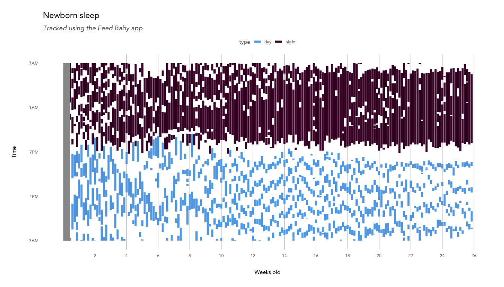
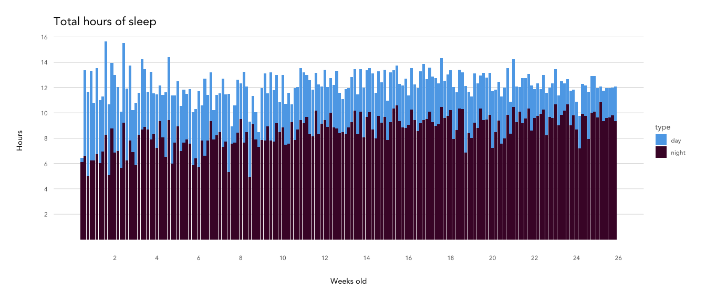
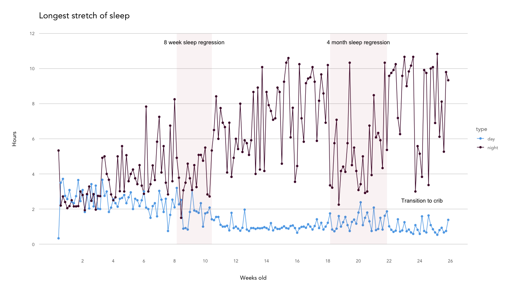
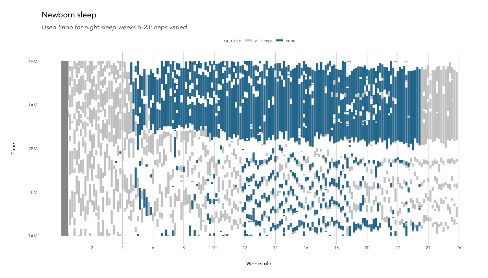

Newborn sleep
================

``` r
library(tidyverse)
library(lubridate)
source('../../kp_themes/theme_kp.R')
theme_set(theme_classic() + theme_kp())
options(scipen = 999)
knitr::opts_chunk$set(echo = TRUE, fig.width = 8, fig.height = 6, 
                      warning = FALSE, error = FALSE, message = FALSE)

feedbaby_raw <- read.csv('data/feedbaby_sleeps.csv', stringsAsFactors = FALSE)
snoo_raw <- read.csv('data/snoo_sleeps.csv', stringsAsFactors = FALSE)
```

In the haze of sleep deprivation, it can be difficult to remember when
the baby last ate or how long ago you changed her. A friend recommended
the [Feed Baby
app](https://apps.apple.com/us/app/feed-baby-breastfeeding-app/id868611155)
to track diaper changes, feeds, sleep, weight, and so on, and we
immediately traded in the pen + paper tracker provided by the hospital
for a digital tracker. As a data nerd, I also assumed I’d be able to use
the meticulously tracked data to better understand my baby and maybe
even figure out how to make her sleep longer (LOL). *Narrator: she did
not.*

TL;DR: Time is the biggest predictor for improved baby sleep, though
development isn’t linear. Type A parents: you just have to ride this one
out (or get lucky with a naturally great sleeper).

``` r
knitr::include_graphics("images/feedbaby_screenshot.png")
```


The app also has a feature that lets you download the data as several
.csv files (one for sleep, one for feeds, etc). Here’s a look at the
`sleep.csv` export.

``` r
str(feedbaby_raw)
```

    ## 'data.frame':    1046 obs. of  5 variables:
    ##  $ id                            : int  2 1 3 4 5 6 7 8 9 10 ...
    ##  $ Start.Time                    : chr  "11:20PM 01-24-2020" "1:40AM 01-25-2020" "8:30AM 01-25-2020" "3:25PM 01-25-2020" ...
    ##  $ End.Time                      : chr  "12:08AM 01-25-2020" "7:20AM 01-25-2020" "12:00PM 01-25-2020" "6:42PM 01-25-2020" ...
    ##  $ Notes                         : chr  "" "" "" "" ...
    ##  $ Approximate.Duration..Minutes.: int  48 340 210 197 45 132 101 77 39 223 ...

### Preprocessing the data

First, I split sessions into individual days (e.g. sessions crossing
over midnight would become one ending at 11:59 PM and a second one
starting at 12:00 AM). For cleaner visualization, I then shifted the
times to allow for a plot with the x axis beginning at 7 AM rather than
12 AM to more clearly delineate day and night sleeps.

``` r
date_shift_and_split <- function(df,
                                 start_time_numeric = 'start_time_numeric', 
                                 end_time_numeric = 'end_time_numeric',
                                 shifted_day_start = 7) {
  
  shifted_df <- df %>%
    mutate(start_time_shift = ifelse(!! sym(start_time_numeric) < shifted_day_start, !! sym(start_time_numeric) + 24, !! sym(start_time_numeric)),
           end_time_shift = ifelse(!! sym(end_time_numeric) < shifted_day_start, !! sym(end_time_numeric) + 24, !! sym(end_time_numeric)),
           start_date_shift = as.Date(ifelse(start_time_shift >= 24, start_date - lubridate::days(1), start_date), origin = '1970-01-01'),
           end_date_shift = as.Date(ifelse(end_time_shift >= 24, end_date - lubridate::days(1), end_date), origin = '1970-01-01'),
           split = ifelse(start_date_shift != end_date_shift, 'original', NA)
           )
  
  splits <- shifted_df %>%
    filter(split == 'original') %>%
    mutate(split = 'duplicate')

  out_df <- shifted_df %>%
    rbind(splits) %>%
    arrange(start_date_shift, start_time_shift, split) %>%
    mutate(end_time_shift = case_when(split == 'original' ~ (shifted_day_start + 24), 
                                      TRUE ~ end_time_shift),
           start_time_shift = case_when(split == 'duplicate' ~ shifted_day_start,
                                        TRUE ~ start_time_shift)
  )
  
  return(out_df)

}

session_type <- function(df, 
                         night_start = 18.75, 
                         night_end = 7, 
                         start_time = 'start_time_shift',
                         end_time = 'end_time_shift'){
  
  df %>%
    mutate(type = ifelse(!! sym(start_time) >= night_start | !! sym(end_time) < night_end,
                         'night', 
                         'day'))
  
}

baby_age <- function(df, 
                     start_date = 'start_date_shift',
                     birth_date = as.Date('2020-01-21')){
  
  df %>%
    mutate(days_old = as.numeric(difftime(!! sym(start_date), birth_date)), 
           weeks_old = days_old/7)
}

preprocess_sleep <- function(df){
  
  df <- date_shift_and_split(df)
  df <- session_type(df)
  df <- baby_age(df)
  
  return(df)
  
}
```

``` r
feedbaby_sleep <- feedbaby_raw %>%
  mutate(start_datetime = parse_date_time(Start.Time, '%I:%M%p %m-%d-%Y'),
         end_datetime = parse_date_time(End.Time, '%I:%M%p %m-%d-%Y'),
         start_date = mdy(format(start_datetime, '%m-%d-%y')),
         start_time_numeric = hour(start_datetime) + minute(start_datetime)/60,
         end_date = mdy(format(end_datetime, '%m-%d-%y')),
         end_time_numeric = hour(end_datetime) + minute(end_datetime)/60,
         location = 'all sleeps'
         ) %>%
  select(c('start_datetime', 'end_datetime', 'start_date', 'end_date', 'start_time_numeric', 'end_time_numeric', 'location'))

feedbaby_sleep_processed <- preprocess_sleep(feedbaby_sleep)

str(feedbaby_sleep_processed)
```

    ## 'data.frame':    1091 obs. of  15 variables:
    ##  $ start_datetime    : POSIXct, format: "2020-01-24 23:20:00" "2020-01-25 01:40:00" ...
    ##  $ end_datetime      : POSIXct, format: "2020-01-25 00:08:00" "2020-01-25 07:20:00" ...
    ##  $ start_date        : Date, format: "2020-01-24" "2020-01-25" ...
    ##  $ end_date          : Date, format: "2020-01-25" "2020-01-25" ...
    ##  $ start_time_numeric: num  23.33 1.67 1.67 8.5 15.42 ...
    ##  $ end_time_numeric  : num  0.133 7.333 7.333 12 18.7 ...
    ##  $ location          : chr  "all sleeps" "all sleeps" "all sleeps" "all sleeps" ...
    ##  $ start_time_shift  : num  23.3 7 25.7 8.5 15.4 ...
    ##  $ end_time_shift    : num  24.13 7.33 31 12 18.7 ...
    ##  $ start_date_shift  : Date, format: "2020-01-24" "2020-01-24" ...
    ##  $ end_date_shift    : Date, format: "2020-01-24" "2020-01-25" ...
    ##  $ split             : chr  NA "duplicate" "original" NA ...
    ##  $ type              : chr  "night" "day" "night" "day" ...
    ##  $ days_old          : num  3 3 3 4 4 4 4 4 4 4 ...
    ##  $ weeks_old         : num  0.429 0.429 0.429 0.571 0.571 ...

## Newborn sleep

Some important details:

  - I was very lucky to be home with my daughter full time for 19 weeks.
    Because of COVID-19, we started limiting social visits, errands, and
    basically most leaving the house except for doctor appointments when
    she was 8 weeks old. When she was 10 weeks old, a stay-at-home order
    was enacted in Minnesota. Because we spent 99% of our time at home
    and have no other children, we were able to let her dictate when to
    eat, nap, play, etc., rather than trying to conform her to our
    schedule, so her sleep is likely the best it could possibly be for
    her\! The order ended when she was 18 weeks old, but we’ve opted to
    keep her home outside of daycare and the occasional family visit.  
  - She is breastfed so she needs to eat more frequently than a formula
    or combination-fed baby.  
  - We didn’t start tracking reliably until we came home from the
    hopsital, so those dates are greyed out.

<!-- end list -->

``` r
feedbaby_sleep_processed %>%
  ggplot() + 
  geom_segment(aes(x = start_time_shift, 
                   xend = end_time_shift, 
                   y = weeks_old, 
                   yend = weeks_old,
                   color = type), 
               size = 2) +
  geom_rect(aes(xmin = 7, xmax = 31, ymin = 0, ymax = 3/7), fill = 'grey60') +
  scale_x_continuous(breaks = c(7,13,19,25,31), 
                     labels = c('7AM', '1PM', '7PM', '1AM', '7AM')) +
  scale_y_continuous(breaks = c(2,4,6,8,10,12,14,16,18,20,22,24)) +
  coord_flip() +
  labs(title = 'Newborn sleep', 
       subtitle = 'Tracked using the Feed Baby app',
       x = 'Time', 
       y = 'Weeks old') +
  scale_color_kp(palette = "cool", reverse = TRUE) +
  theme(panel.grid.major.x = element_line(color="grey80"),
        panel.grid.major.y = element_blank(),
        legend.position = 'top') 
```

<!-- -->

You can see how disordered the first few weeks were, with just about as
much day sleep as night sleep. Luckily, her night sleep showed steady
improvements over time. While she wasn’t keen on daytime sleep, she
didn’t have her days and nights mixed up for very long. We got our
first glorious 5 hour stretch around week 4, and the first signs of
being able to sleep through the night between 6-8 weeks.

From weeks 3 to 10, she averaged only two naps a day that were on the
longer side (1-2.5 hours), and could happen at any time. No clear
pattern emerged until about week 11, when she started taking short 30-60
minute naps 4-5 times a day. She transitioned to 4 naps a day around 18
weeks, and then started to show signs of dropping to 3 naps a day around
21 weeks.

How many hours does that add up to each day?

``` r
feedbaby_sleep_processed %>%
  mutate(duration_hours = end_time_shift - start_time_shift) %>% 
  group_by(weeks_old, type) %>%
  summarise(total_hours = sum(duration_hours)) %>% 
  ungroup() %>%
  ggplot(aes(x = weeks_old, y = total_hours)) + 
  geom_col(aes(fill = type)) +
  scale_x_continuous(breaks = c(2,4,6,8,10,12,14,16,18,20,22,24)) +
  scale_y_continuous(breaks = c(2,4,6,8,10,12,14,16)) +
  labs(title = 'Total hours of sleep',
       x = 'Weeks old',
       y = 'Hours') +
  scale_fill_kp(palette = "cool", reverse = TRUE)
```

<!-- -->

Since birth, she’s averaged about 12 hours of sleep each day, much less
than the [14-17 hours per
day](https://www.sleephealthjournal.org/article/S2352-7218\(15\)00015-7/fulltext)
found to be typical for newborns. We expected to need to wake her up to
eat and have her snooze anywhere, but she turned out to be a very alert
baby\! Over time, it’s slowly shifted to be more hours at night and less
during the day.  
How long can she sleep at a time?

``` r
feedbaby_sleep_processed %>%
  mutate(duration_hours = end_time_shift - start_time_shift) %>% 
  group_by(start_date_shift, weeks_old, type) %>%
  summarise(longest_stretch = max(duration_hours)) %>% 
  ggplot(aes(x = weeks_old, y = longest_stretch)) + 
  geom_line(aes(color = type)) +
  geom_point(aes(color = type)) +
  scale_x_continuous(breaks = c(2,4,6,8,10,12,14,16,18,20,22,24)) +
  labs(title = 'Longest stretch of sleep',
       subtitle = 'Feed Baby',
       x = 'Weeks old',
       y = 'Hours') +
  scale_color_kp(palette = "cool", reverse = TRUE)
```

<!-- -->

There’s a pretty clear trend of increasing sleep duration at night and
decreasing duration during the day. She gradually expanded her longest
stretch, typically the first sleep of the night, from ~2.5 hours in the
beginning to 8 by week 8 or so, and then had a bit of a regression,
likely corresponding to a growth spurt or [Wonder
Week](https://www.thewonderweeks.com/mental-leap-2/). At the same time,
her naps got shorter and shorter until they lasted just a single sleep
cycle. The [fourth month sleep
regression](https://takingcarababies.com/understanding-the-dreaded-four-month-sleep-regression/)
hit around week 18 and lasted until week 22, with sleep reverting to 2-3
hour stretches at best. At the same time, some naps started to lengthen
to 1 or 1.5 hours, showing that she now had the ability to link sleep
cycles on her own.

#### Snoo

One particularly challenging night, we decided to rent a Snoo, a [smart
bassinet](https://www.happiestbaby.com/pages/snoo) that responsively
rocks and plays white noise to extend your baby’s sleep. It came with an
app that displayed each stretch of sleep and how long/when the bassinet
ramped up its soothing measures to quiet a fussy baby.

``` r
knitr::include_graphics("images/snoo_screenshot.jpg")
```


I was excited to see that you can access your Snoo data using the
[Python package `Snoo`](https://pypi.org/project/snoo/).

``` r
str(snoo_raw)
```

    ## 'data.frame':    694 obs. of  5 variables:
    ##  $ start_time: chr  "2020-02-15T16:44:48" "2020-02-15T17:00:42" "2020-02-17T18:17:47" "2020-02-23T03:47:14" ...
    ##  $ end_time  : chr  "2020-02-15T16:44:49" "2020-02-15T17:16:21" "2020-02-17T18:36:08" "2020-02-23T06:50:24" ...
    ##  $ duration  : int  1 939 1101 10990 11033 10780 351 10259 18219 2892 ...
    ##  $ asleep    : int  1 187 440 10990 10932 10780 351 9227 18219 2407 ...
    ##  $ soothing  : int  0 752 661 0 101 0 0 1032 0 485 ...

While I credit the constantly gentle motion of the Snoo for helping her
sleep longer, the higher-motion, higher-volume white-noise “soothing”
levels triggered by noise and movement (fussing) were never able to calm
her back to sleep. Basically, if she woke up enough to trigger the
soothing, she wasn’t going to go back to sleep without parent
intervention. Because we didn’t find them to be impactful, I have
disregarded them here. Also, the data only tells you total time spent
soothing vs. asleep with no indication of when the soothing happened, if
it was multiple soothing sessions, etc., so I don’t think it would be
very useful to analyze anyway.

``` r
snoo_sleep <- snoo_raw %>%
  mutate(start_datetime = as.POSIXct(gsub('T', ' ', start_time)),
         end_datetime = as.POSIXct(gsub('T', ' ', end_time)),
         start_date = as.Date(start_time),
         end_date = as.Date(end_time),
         start_time = sapply(start_time, function(x) strsplit(x, 'T')[[1]][2]),
         end_time = sapply(end_time, function(x) strsplit(x, 'T')[[1]][2]),
         start_time_numeric = as.numeric(substring(start_time, 1, 2)) + as.numeric(substring(start_time, 4, 5))/60,
         end_time_numeric = as.numeric(substring(end_time, 1, 2)) + as.numeric(substring(end_time, 4, 5))/60,
         location = 'snoo'
  ) %>%
  select(c('start_datetime', 'end_datetime', 'start_date', 'end_date', 'start_time_numeric', 'end_time_numeric', 'location'))

snoo_sleep_processed <- preprocess_sleep(snoo_sleep)

str(snoo_sleep_processed)
```

    ## 'data.frame':    720 obs. of  15 variables:
    ##  $ start_datetime    : POSIXct, format: "2020-02-15 16:44:48" "2020-02-15 17:00:42" ...
    ##  $ end_datetime      : POSIXct, format: "2020-02-15 16:44:49" "2020-02-15 17:16:21" ...
    ##  $ start_date        : Date, format: "2020-02-15" "2020-02-15" ...
    ##  $ end_date          : Date, format: "2020-02-15" "2020-02-15" ...
    ##  $ start_time_numeric: num  16.73 17 18.28 3.78 21.33 ...
    ##  $ end_time_numeric  : num  16.73 17.27 18.6 6.83 0.4 ...
    ##  $ location          : chr  "snoo" "snoo" "snoo" "snoo" ...
    ##  $ start_time_shift  : num  16.7 17 18.3 27.8 21.3 ...
    ##  $ end_time_shift    : num  16.7 17.3 18.6 30.8 24.4 ...
    ##  $ start_date_shift  : Date, format: "2020-02-15" "2020-02-15" ...
    ##  $ end_date_shift    : Date, format: "2020-02-15" "2020-02-15" ...
    ##  $ split             : chr  NA NA NA NA ...
    ##  $ type              : chr  "day" "day" "day" "night" ...
    ##  $ days_old          : num  25 25 27 32 33 33 33 34 34 34 ...
    ##  $ weeks_old         : num  3.57 3.57 3.86 4.57 4.71 ...

``` r
feedbaby_sleep_processed %>%
  rbind(snoo_sleep_processed) %>% 
  ggplot() + 
  geom_segment(aes(x = start_time_shift, 
                   xend = end_time_shift, 
                   y = weeks_old, 
                   yend = weeks_old,
                   color = location), 
               size = 2) +
  geom_rect(aes(xmin = 7, xmax = 31, ymin = 0, ymax = 3/7), fill = 'grey60') +
  scale_x_continuous(breaks = c(7,13,19,25,31), 
                     labels = c('7AM', '1PM', '7PM', '1AM', '7AM')) +
  scale_y_continuous(breaks = c(2,4,6,8,10,12,14,16,18,20,22,24)) +
  coord_flip() +
  labs(title = 'Newborn sleep', 
       subtitle = 'Began using the Snoo for night sleep ~5 weeks; naps varied',
       x = 'Time', 
       y = 'Weeks old') +
  scale_color_manual(values = c('grey80', '#2F7C9F')) +
  theme(panel.grid.major.x = element_line(color="grey80"),
        panel.grid.major.y = element_blank(),
        axis.text.x = element_text(margin = margin(0,10,0,0)),
        legend.position = 'top')
```

<!-- -->

For the first five weeks, she mostly slept on us or in her regular
bassinet, with varying degrees of success. Once we got the Snoo set up,
we spent a week or so acclimating her to it (at first she hated the
motion) and then shifted her into it for all night sleep. We still held
her for most naps because she would only sleep about 45 minutes in the
Snoo, but we could extend her naps longer if we held her. Around 10
weeks, her naps got short no matter if we held her or not, so we tried
moving them into the Snoo, but didn’t get successful until week 12 or
so.

She started daycare at week 19, so midday naps happened there and not in
the Snoo. We often had her take her first nap at home (my partner
typically works second shift and can do daycare drop-off a little later)
and nearly always put her down for a short catnap after I picked her up
around 4:30.

There is some variance between the Feed Baby and Snoo sleep sessions
because Feed Baby is tracked manually, while the Snoo automatically
records each time it is turned on. Sometimes she would fall asleep for a
while before being placed in the Snoo, or wake up right when we tried to
set her down. I tried to keep the Feed Baby sessions accurate to her
actual sleep time, while the Snoo is more a measure of when the bassinet
was turned on.
